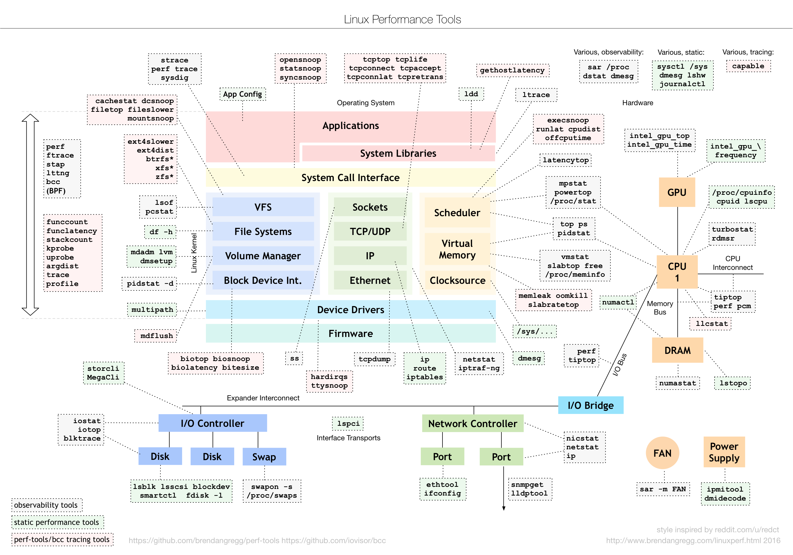

# 嵌入式操作系统小组

### 成员

- 施鹤远
- 王润哲
- 孙浩

【历史成员】韦康（华为），佘磊（某部），陈威行（百度），张亚飞（ihandy），孟骋（阿里），林航

## 当前任务

- 内核导向模糊测试。
- 业务负载提取建模。
- 内核代码克隆检测。
- 内核导向性初始语料库测试用例生成

## 历史研究

### 轨道交通嵌入式操作系统国产化
1. 网卡、网关操作系统替换（MVB, WTB, UIC）
2. 交换机操作系统国产化
3. 自主操作系统可靠性保障

### 轨道交通交换机Linux网络性能优化
- 时间：2016.9-2016.11
- 人员：佘磊、韦康、施鹤远、孙家昌、陈渝、茅俊杰、万海
- 问题：四方所基于Linux的NAT性能低下（仅能保证双核35M不丢包）
- 指标：针对Linux进行NAT网络性能优化，提高NAT性能至100M不丢包
- 结果：通过精简配置、修改内核达到双核百兆不丢包
- 成果
  - [交付四方所性能优化技术报告](https://github.com/shiheyuan/rtos/blob/master/%E5%86%85%E6%A0%B8NAT%E6%80%A7%E8%83%BD%E4%BC%98%E5%8C%96%E5%88%86%E6%9E%90.pdf)
  - [基于ftrace的Linux协议栈函数流程分析](https://github.com/shiheyuan/rtos/blob/master/ftrace%E5%87%BD%E6%95%B0%E6%B5%81%E7%A8%8B%E5%88%86%E6%9E%90.txt)
  - [NAT性能优化配置表](https://github.com/shiheyuan/rtos/blob/master/config_simple.txt)
  - [基于Linux Hook函数实现的自主双向NAT代码](https://github.com/shiheyuan/rtos/blob/master/nat_full.c)
  - [基于Linux Hook函数实现的自主单向NAT代码](https://github.com/shiheyuan/rtos/blob/master/nat_part.c)
  - [实验清单(点击后在新页面点击view raw下载查看)](https://github.com/shiheyuan/rtos/blob/master/nat_part.c)
- 参考资料
  - [Linux内核协议栈分析](http://blog.csdn.net/qy532846454/article/category/1385933/2)
  - [Linux内核参数说明](http://blog.csdn.net/zdy0_2004/article/details/50379422)
  - 
